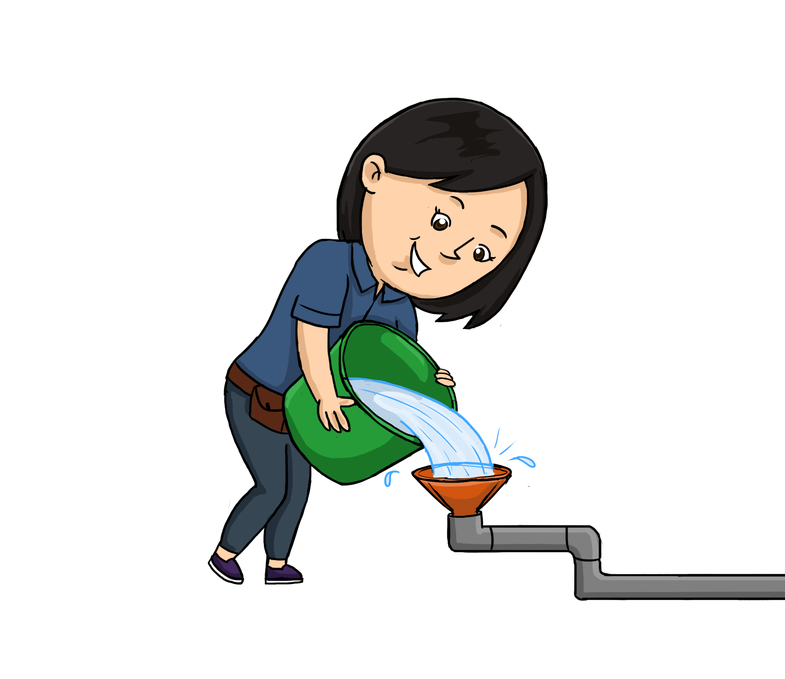

```{r, include = FALSE}
source("_helpers.R")
```

```{r, echo=FALSE,  out.width="45%", out.extra = 'style="float:right;"'}

```

Plumber's first job is to execute R code in response to incoming HTTP requests, so it's important to understand how incoming HTTP requests get translated into the execution of R functions.

An incoming HTTP request must be "routed" to one or more R functions. Plumber has two distinct families of functions that it handles: endpoints and filters.

Typically, when a request arrives to a Plumber router, Plumber begins by passing that request through its filters. Once the request has been processed by all the filters, the router will look for an endpoint that can satisfy the incoming request. If it finds one, it will invoke the endpoint and respond to the incoming request using the value the endpoint returned. If no endpoint matches the request, then a `404 Not Found` error will be returned (the behavior of which can be controlled by the [`set404Handler`](./programmatic-usage.html#customize-router) method).

## Endpoints {#endpoints}

Endpoints are the terminal step in the process of serving a request. An endpoint can simply be viewed as the logic that is ultimately responsible for generating a response to a particular request. A request will be checked against each available endpoint until it finds an endpoint willing to serve it at which point it stops looking; i.e. a request will not ever be processed by more than one endpoint. You create an endpoint by annotating a function like so:

```{r, eval=FALSE, code = readLines("files/apis/03-01-endpoint.R")}
```

This annotation specifies that this function is responsible for generating the response to any `GET` request to `/hello`. The value returned from the function will be used as the response to the request (after being run through a serializer to e.g. convert the response into JSON). In this case, a `GET` response to `/hello` would return the content `["hello world"]` with a `JSON` `Content-Type`.

The annotations that generate an endpoint include:

 - `@get`
 - `@post`
 - `@put`
 - `@delete`
 - `@head`

These map to the HTTP methods that an API client might send along with a request. By default when you open a page in a web browser, that sends a `GET` request to the API. But you can use other API clients (or even JavaScript inside of a web browser) to form HTTP requests using the other methods listed here. There are conventions around when each of these methods should be used which you can read more about [here](http://www.restapitutorial.com/lessons/httpmethods.html). Note that some of these conventions carry with them security implications, so it's a good idea to follow the recommended uses for each method until you fully understand why you might deviate from them.

Note that a single endpoint can support multiple verbs. The following function would be used to service any incoming `GET`, `POST`, or `PUT` request to `/cars`.

```r
#' @get /cars
#' @post /cars
#' @put /cars
function(){
  ...
}
```

## Filters {#filters}

Plumber filters can be used to define a "pipeline" for handling incoming requests. This allows API authors to break down complex logic into a sequence of independent, understandable steps. Unlike endpoints, a request may go through multiple Plumber filters before a response is generated.

Typically, a Plumber router will pass a request through all the defined filters before it attempts to find an endpoint to satisfy the request. However, endpoints can "preempt" particular filters if they want to be considered for execution before some filter(s) registered in the router.

Filters can do one of three things in handling a request:

1. Forward control onto the next handler, potentially after mutating the request.
2. Return a response itself and not forward to subsequent handlers
3. Throw an error

These three options, and why each might be desired, are discussed below.

### Forward to Another Handler

The most common behavior for a filter is to pass on the request to the next handler after mutating the incoming request or invoking some external side-effect. One common use case is to use a filter as a request logger:

```r
#* Log some information about the incoming request
#* @filter logger
function(req){
  cat(as.character(Sys.time()), "-",
    req$REQUEST_METHOD, req$PATH_INFO, "-",
    req$HTTP_USER_AGENT, "@", req$REMOTE_ADDR, "\n")
  plumber::forward()
}
```

This filter is straightfoward: it invokes an external action (logging) and then calls `forward()` to pass control to the next handler in the pipeline (another filter or an endpoint).

Because the `req` and `res` parameters in Plumber are based on R environments, they exhibit "pass-by-reference" behavior. This means that changes that are made in one filter on the `req` or `res` object will be visible to other filters or endpoints also touching this same request or response.

A similar filter may mutate some state on the request or response object it's given.

```r
#* @filter setuser
function(req){
  un <- req$cookies$user
  # Make req$username available to endpoints
  req$username <- un

  plumber::forward()
}
```

In this case, the `req` object is going to be extended to have an additional property named `username` which represents a value looked up from a cookie. This `req$username` property would be available to all subsequent filters and endpoints processing this request. (Note that this example is not a secure system for authentication; see the [section on using cookies to store state](./execution-model.html#state-cookies) for a longer discussion on why.) Once it has modified the request object, it passes control to the next handler using `forward()`.

### Return a Response

It is also possible for filters to return a response. You may want to check that the request satisfies some constraint (like authentication) and -- in certain cases -- return a response without invoking any additional handlers. For example, a filter could be used to check that a user has authenticated.

```r
#* @filter checkAuth
function(req, res){
  if (is.null(req$username)){
    res$status <- 401 # Unauthorized
    return(list(error="Authentication required"))
  } else {
    plumber::forward()
  }
}
```

A common cause of errors in Plumber APIs is forgetting to invoke `forward()` in your filters. In such a filter, the result of the last line will be silently returned as the response to the incoming request. This can cause your API to exhibit very odd behavior depending on what's being returned. When you're using filters, be sure to carefully audit all code paths to ensure that you're either calling `forward()`, causing an error, or intentionally returning a value.

### Throw an Error

Finally, a filter can throw an error. This can occur if a mistake is made in the code defining the filter or if the filter intentionally invokes `stop()` to trigger an error. In this case, the request will not be processed by any subsequent handlers and will immediately be sent to the router's error handler. See [router customization](./programmatic-usage.html#customize-router) for more details on how to customize this error handler.

## Dynamic Routes {#dynamic-routes}

In addition to having hard-coded routes like `/hello`, Plumber endpoints can have dynamic routes. Dynamic routes allow endpoints to define a more flexible set of paths against which they should match.

A common REST convention is to include the identifier of an object in the API paths associated with it. So to lookup information about user #13, you might make a `GET` request to the path `/users/13`. Rather than having to register routes for every user your API might possibly encounter, you can use a dynamic route to associate an endpoint with a variety of paths.

```{r, eval = FALSE, code = readLines("files/apis/03-01-dynamic.R")}
```

This API uses the dynamic path `/users/<id>` to match any request that is of the form `/users/` followed by some path element like a number or letters. In this case, it will return information about the user if a user with the associated ID was found, or an empty object if not.

You can name these dynamic path elements however you'd like, but note that the name used in the dynamic path must match the name of the parameter for the function (in this case, both `id`).

You can even do more complex dynamic routes like:

```r
#' @get /user/<from>/connect/<to>
function(from, to){
  # Do something with the `from` and `to` variables...
}
```

In both the hard-coded and dynamic examples given above, the parameters will be provided to the function as a character string.

## Typed Dynamic Routes {#typed-dynamic-routes}

Unless otherwise instructed, all parameters passed into plumber endpoints from query strings or dynamic paths will be character strings. For example, consider the following API.

```{r, eval = FALSE, code = readLines("files/apis/03-02-types.R")}
```

Visiting http://localhost:8000/types/14 will return:

```{r, echo=FALSE, results='asis'}
pr <- plumber::plumb("files/apis/03-02-types.R")
e <- pr$endpoints[[1]][[1]]
code_chunk(json_serialize(e$exec(id="14")), "json")
```

If you only intend to support a particular data type for a particular parameter in your dynamic route, you can specify the desired type in the route itself.

```r
#* @get /user/<id:int>
function(id){
  next <- id + 1
  # ...
}

#* @post /user/activated/<active:bool>
function(active){
  if (!active){
    # ...
  }
}
```

Specifying the type of a dynamic path element will also narrow the paths that will match the endpoint. For instance, the path `/users/123` will match the first endpoint, but `/users/8e3k` will not, since `8e3k` is not an integer.

The following details the mapping of the type names that you can use in your dynamic types and how they map to R data types.

R Type  | Plumber Name
------- | ---------
logical |	`bool`, `logical`
numeric	| `double`, `numeric`
integer	| `int`

## Static File Handler

Plumber includes a static file server which can be used to host directories of static assets such as JavaScript, CSS, or HTML files. These servers are fairly simple to configure and integrate into your plumber application.

```r
#* @assets ./files/static
list()
```

This example would expose the local directory `./files/static` at the default `/public` path on your server. So if you had a file `./files/static/branding.html`, it would be available on your Plumber server at `/public/branding.html`.

You can optionally provide an additional argument to configure the public path used for your server. For instance

```r
#* @assets ./files/static /static
list()
```

would expose the local directory `files/static` not at `/public`, but at `/static`. Likewise, to serve a main `index.html`, you can also map `/files/static` to `/` by using

```r
#* @assets ./files/static /
list()
```
That enables you to serve your `/files/static/index.html` under the http://localhost:8000/ root URL.

The "implementation" of your server in the above examples is just an empty `list()`. You can also specify a `function()` like you do with the other plumber annotations. At this point, the implementation doesn't alter the behavior of your static server. Eventually, this list or function may provide an opportunity to configure the server by changing things like cache control settings.

If you're configuring a Plumber router programmatically, you can instantiate a special static file router and mount it onto another router as discussed in the [static file router section](./programmatic-usage.html#mount-static).

## Input Handling {#input-handling}

Plumber routes requests based exclusively on the path and method of the incoming HTTP request, but requests can contain much more information than just this. They might include additional HTTP headers, a query string, or a request body. All of these fields may be viewed as "inputs" to your Plumber API.

### The Request Object

HTTP requests in Plumber are stored as environments and satisfy the [Rook interface](https://github.com/jeffreyhorner/Rook/blob/a5e45f751/README.md#the-environment). The expected objects for all HTTP requests are the following.

Name | Example | Description
---- | ------- | -----------------------
`pr` | `plumber::pr()` | The Plumber router that is processing the request
`cookies` | `list(cook="abc")` | A list of the cookies as described in [Cookies](#read-cookies)
`httpuv.version` | `"1.3.3"` | The version of the underlying [`httpuv` package](https://github.com/rstudio/httpuv)
`PATH_INFO` | `"/"` | The path of the incoming HTTP request
`postBody` | `"a=1&b=2"` | The text contents of the body of the request. Despite the name, it is available for any HTTP method. To disable this parsing, see `?options_plumber`.
`postBodyRaw` | `charToRaw("a=1&b=2")` | The `raw()`, unparsed contents of the body of the request
`args` | `list(a=1,b=2)` | In a route, the combined arguments of `list(req = req, res = res)`, `argsPath`, `argsPostBody`, and `argsQuery`. In a filter, only contains `argsQuery`.
`argsPath` | `list(a=1,b=2)` | The values of the path arguments.
`argsQuery` | `list(a=1,b=2)` | The parsed query string output.
`argsPostBody` | `list(a=1,b=2)` | The parsed post boy output.
`QUERY_STRING` | `"?a=123&b=abc"` | The query-string portion of the HTTP request
`REMOTE_ADDR` | `"1.2.3.4"` | The IP address of the client making the request
`REMOTE_PORT` | `"62108"` | The client port from which the request originated
`REQUEST_METHOD` | `"GET"` | The method used for this HTTP request
`rook.errors` | N/A | See [Rook docs]( https://github.com/jeffreyhorner/Rook/blob/a5e45f751/README.md#the-input-stream)
`rook.input` | N/A | See [Rook docs]( https://github.com/jeffreyhorner/Rook/blob/a5e45f751/README.md#the-error-stream)
`rook.url_scheme` | `"http"` | The "scheme" (typically `http` or `https`)
`rook.version` | `"1.1-0"` | The version of the rook specification which this environment satisfies
`SCRIPT_NAME` | `""` | Unused
`SERVER_NAME` | `"127.0.0.1"` | The host portion of the incoming request. You may favor `HTTP_HOST`, if available.
`SERVER_PORT` | `"8000"` | The target port for the request
`HTTP_*` | `"HTTP_USER_AGENT"` | Entries for all of the HTTP headers sent with this request

### Query Strings {#query-strings}

A query string may be appended to a URL in order to convey additional information beyond just the request route. Query strings allow for the encoding of character string keys and values. For example, in the URL `https://duckduckgo.com/?q=bread&pretty=1`, everything following the `?` constitutes the query string. In this case, two variables (`q` and `pretty`) have been set (to `bread` and `1`, respectively).

Plumber will automatically forward information from the query string into the function being executed by aligning the name of the query string with the name of the function parameter. The following example defines a search API that mimics the example from [DuckDuckGo](https://duckduckgo.com) above but merely prints out what it receives.

```{r, eval = FALSE, code = readLines("files/apis/03-03-search.R")}
```

Visiting http://localhost:8000/?q=bread&pretty=1 will print:

```{r, echo=FALSE, results='asis'}
pr <- plumber::plumb("files/apis/03-03-search.R")
e <- pr$endpoints[[1]][[1]]
code_chunk(json_serialize(e$exec(q="bread", pretty="1")), "json")
```

This is equivalent to calling `search(q="bread", pretty="1")`. If a parameter were not specified in the query string, it would just be omitted from the invocation of the endpoint. For example http://localhost:8000/?q=cereal would be equivalent to `search(q="cereal")`. The function would fall back to the default value of the `pretty` parameter (`0`), since that was defined in the function signature.

```{r, echo=FALSE, results='asis'}
code_chunk(json_serialize(e$exec(q="cereal")), "json")
```

Including additional query string arguments that do not map to a parameter of the function has no effect. For instance http://localhost:8000/?test=123 will return the same results as calling `search()`.

```{r, echo=FALSE, results='asis'}
code_chunk(json_serialize(e$exec()), "json")
```

(Note that the raw query string is available as `req$QUERY_STRING`.)

Some web browsers impose limitations on the length of a URL. Internet Explorer, in particular, caps the query string at 2,048 characters. If you need to send large amounts of data from a client to your API, it would likely be a better idea to send it in a [request body](#request-body).

### Request Body {#request-body}

Another way to provide additional information inside an HTTP request is using the message body. Effectively, once a client specifies all the metadata about a request (the path it's trying to reach, some HTTP headers, etc.) it can then provide a message body. The maximum size of a request body depends largely on the technologies involved (client, proxies, etc.) but is typically at least 2MB -- much larger than a query string. This approach is most commonly seen with `PUT` and `POST` requests, though you could encounter it with other HTTP methods.

Plumber will attempt to parse the request body in one of two ways: if it appears that the message is JSON, then Plumber will parse the body as a JSON message; otherwise it will decode it as a standard query string. Any fields provided in the message body in either format will be passed through as parameters to the function.

Unfortunately, crafting a request with a message body requires a bit more work than making a `GET` request with a query string from your web browser, but you can use tools like `curl` on the command line or the [httr R package](https://github.com/hadley/httr/). We'll use `curl` for the examples below.

```{r, eval = FALSE, code = readLines("files/apis/03-04-body.R")}
```

Running `curl --data "id=123&name=Jennifer" "http://localhost:8000/user"` will return:

```{r, echo=FALSE, results='asis'}
pr <- plumber::plumb("files/apis/03-04-body.R")
e <- pr$endpoints[[1]][[1]]
code_chunk(json_serialize(e$exec(req=list(postBody="id=123&name=Jennifer"), id=123, name="Jennifer")), "json")
```

Alternatively, `curl --data '{"id":123, "name": "Jennifer"}' "http://localhost:8000/user"` (formatting the body as JSON) will have the same effect.

As demonstrated above, the raw request body is made available as `req$postBody` and `req$postBodyRaw`.

If multiple parameters are matched to the endpoint formals, an error will be thrown. Due to the nature of how multiple values can be matched to the same argument, it is recommended that `POST` enpoints have a function definition that only accepts the formals `req`, `res`, and `...`. If the endpoint arguments are to be processed like a list, they are available at `req$argsPostBody`, with all arguments at `req$args`. `req$args` is a combination of `list(req = req, res = res)`, `req$argsPath`, `req$argsPostBody`, and `req$argsQuery`.

### Cookies {#read-cookies}

If cookies are attached to the incoming request, they'll be made available via `req$cookies`. This will contain a list of all the cookies that were included with the request. The names of the list correspond to the names of the cookies and the value for each element will be a character string. See the [Setting Cookies section](./rendering-output.html#setting-cookies) for details on how to set cookies from Plumber.

If you've set encrypted cookies (as discussed in the [Encrypted Cookies section](./rendering-output.html#encrypted-cookies)), that session will be decrypted and made available at `req$session`.

### Headers

HTTP headers attached to the incoming request are attached to the request object. They are prefixed with `HTTP_`, the name of the header is capitalized, and hyphens are substituted for underscores. e.g. the `Content-Type` HTTP header can be found as `req$HTTP_CONTENT_TYPE`.

```{r, eval = FALSE, code = readLines("files/apis/03-05-headers.R")}
```

Running `curl --header "customheader: abc123" http://localhost:8000` will return:

```{r, echo=FALSE, results='asis'}
code_chunk(json_serialize(list(val="abc123")), "json")
```

You can print out the names of all of the properties attached to the request by running `print(ls(req))` inside an endpoint.
